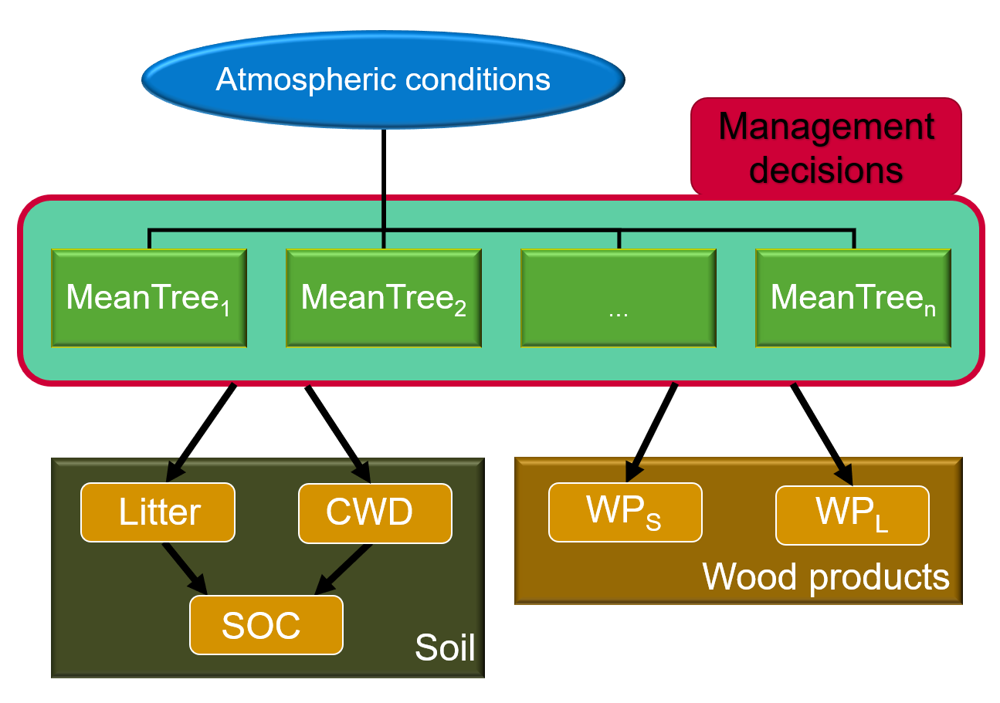

.. BFMM documentation master file, created by
   sphinx-quickstart on Wed Jul 19 17:29:59 2023.
   You can adapt this file completely to your liking, but it should at least
   contain the root `toctree` directive.

Boreal Forest Management Model (BFMM)
=====================================

... by Holger Metzler, Samuli Launiainen, and Giulia Vico

Top-level modules
-----------------

.. autosummary::
    :toctree:
    :recursive:
    :template: module.rst

    ~BFMM.type_aliases
    ~BFMM.utils

Global model components
-----------------------

.. autosummary::
    :toctree:
    :recursive:
    :template: module.rst

    ~BFMM.soil
    ~BFMM.wood_products

Notebooks
=========

.. toctree:: notebooks/Untitled.ipynb

Indices and tables
==================

* :ref:`genindex`
* :ref:`modindex`
* :ref:`search`
